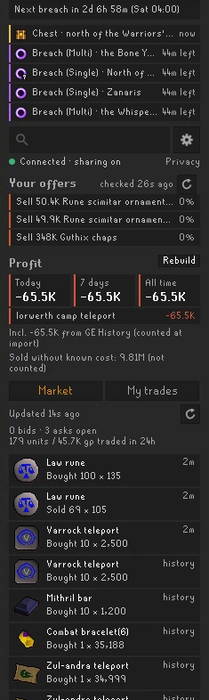
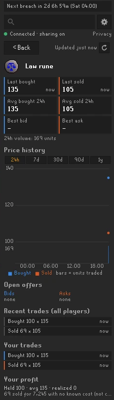
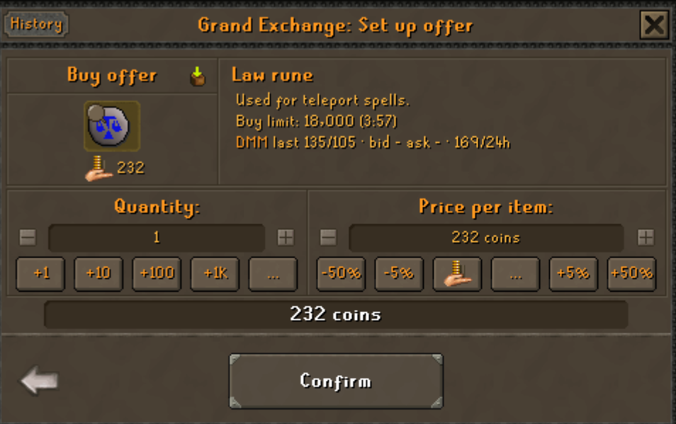
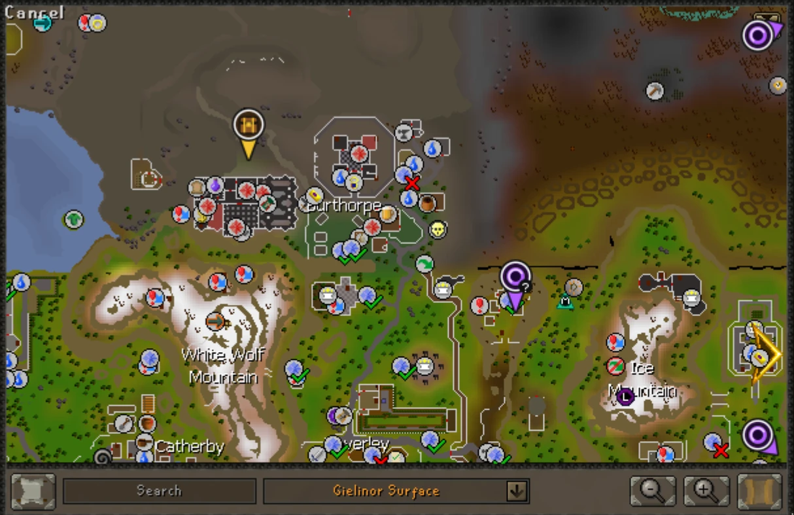
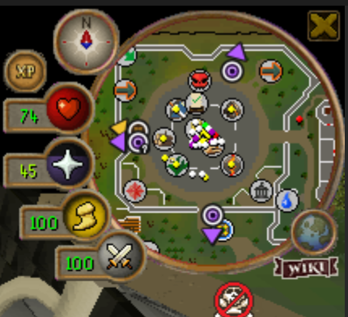

# Deadman Tool Kit

Grand Exchange prices, profit tracking and breach / chest markers for Old School RuneScape's **permanent Deadman world
(345)**.

Deadman has its own economy: the regular GE price guides don't apply there, and the market is thin. Deadman Tool Kit
builds a shared world 345 price index from the trades of the players who use it, keeps track of your own trades and
profit, and puts the game's breach and Deadman's Chest broadcasts on your map. It stays idle on every other world.

## Features

### World 345 market prices

Search any item to see what it actually trades for on world 345: the last bought and sold prices, 24-hour averages and
volume, open bids and asks, recent trades and a price chart from 24 hours to 1 year.

The home view lists your open offers, your profit and a feed of recent world 345 trades. Each open offer is flagged when
someone sells below it or bids above it, or when it hasn't filled for a while. You can also get a notification.

 

### Prices right in the Grand Exchange

When you set up an offer, the item's Deadman prices appear under RuneLite's own GE text, and the item opens in the side
panel.

### Breaches and Deadman's Chests on the map

When the game announces a breach or a Deadman's Chest, the spot is marked on the world map and the minimap, like clue
and quest markers. Markers that are off screen sit on the edge of the map as arrows; click one to jump to it. A **?**
means the broadcast only named a region, not an exact spot. The panel also counts down to the next weekend breach.

### Profit and history

- Realized profit today, over 7 days and all time, per item. It's worked out on your computer from your own trades.
- When your 4-hour GE buy limit for an item resets.
- Past trades are picked up from the game's GE History tab. You can also import the history RuneLite's own Grand
  Exchange plugin keeps (only when you click *Import*).

## Getting started

1. Install **Deadman Tool Kit** from the Plugin Hub and log in to world 345.
2. Open the panel (the gold coin icon in the sidebar) and follow the *Get started* card.
3. Press **Connect** to see the shared market data. Your own trades, profit and the map markers work without it.
4. Open your **GE History** tab once, so past trades are picked up.

## Settings

Under **Configuration > Deadman Tool Kit**, or the gear button in the panel.

| Setting | Default | What it does |
|---|---|---|
| Connect to Deadman Tool Kit server | Off | Shows the shared market data and shares your trades |
| Share my trades / Share world events | On | What is shared while connected |
| Notify when undercut or outbid | Off | A RuneLite notification for your open offers |
| Flag offers with no fill for (hours) | 6 | When an open offer counts as stale |
| Chests / Breaches on the map | On | Each kind of marker can be turned off |
| Arrows on the minimap | On | Events on the minimap: at their spot when close, otherwise as an arrow on the rim |
| Hint arrow to the chest | Off | Points the game's hint arrow at the chest |
| Show breach timer | On | The countdown at the top of the panel |

## Privacy

- Nothing is sent anywhere until you press **Connect**. It is off by default, and RuneLite shows its standard
  third-party warning first.
- Once connected, the plugin shares your own world 345 Grand Exchange trades and open offers (item, price, quantity,
  time), and the breach and chest broadcasts you see. They are sent with a random install id and a hashed account id.
  Your name is never sent, and the server never stores IP addresses.
- **Delete my shared data** in the panel removes everything your computer has shared. You can turn sharing off at any
  time.
- The full privacy notice:
  [deadman-tool-kit-107023686748.europe-north1.run.app/privacy](https://deadman-tool-kit-107023686748.europe-north1.run.app/privacy)

## FAQ

**Why do some items have no price yet?**
The prices come only from trades by players who use the plugin and have connected. The more people connect, the more
items get covered.

**Does it work on other worlds?**
No. It only does anything on world 345, the permanent Deadman world.

**Why is a marker in the wrong spot?**
Broadcasts give a place name, not a tile, and the plugin looks the name up in a list of places. If a marker is wrong or
missing, please report the broadcast text so the place can be added.

## Feedback

Found a bug or have an idea? [Open an issue](https://github.com/Novafifth/deadman-tool-kit/issues), or message
**@Novith** on Discord.

How it all works in detail: [docs/TECHNICAL.md](docs/TECHNICAL.md).
